# Machine Learning

#

# Heart-Machine-Learning-Project 
Dataset yang digunakan adalah heart.csv

### Problem
Ingin mengetahui apakah seseorang tersebut menderita penyakit jantung dilihat dari usia, jenis kelamin, dan tekanan darah pasien

#
### Goals
Dapat memprediksi seseorang tersebut menderita penyakit jantung apa tidak dilihat dari usia, jenis kelamin, tekanan darah, kolestrol, gula darah, dan beberapa variabel lainnya

#
### Data Visualization
**Dataset**
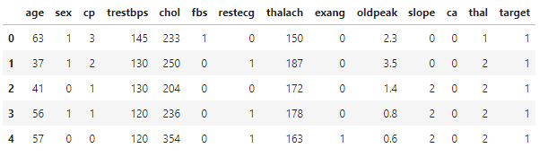

**Describe Data**

**Jumlah penderita penyakit jantung pada dataset**
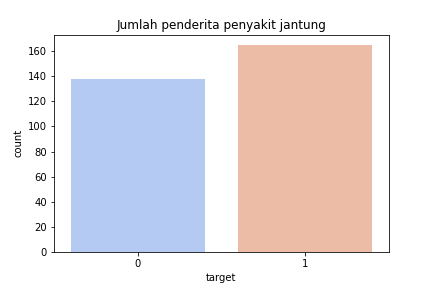

**Jumlah penderita berdasarkan gender**
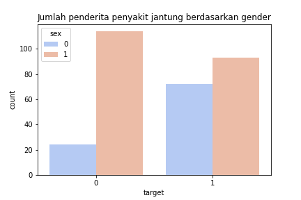

**Jumlah penderita pada dataset berdasarkan usia**
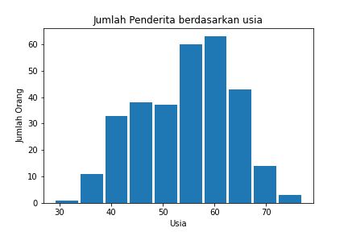

**Penderita dilihat dari usia dan tekanan darah**
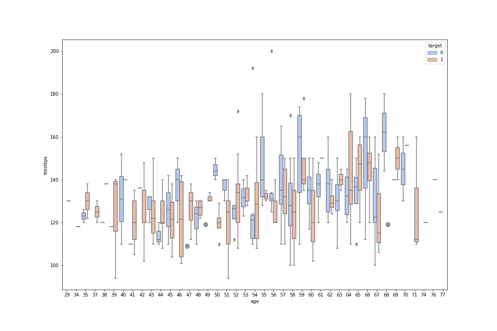

**Penderita dilihat dari usia dan denyut nadi**
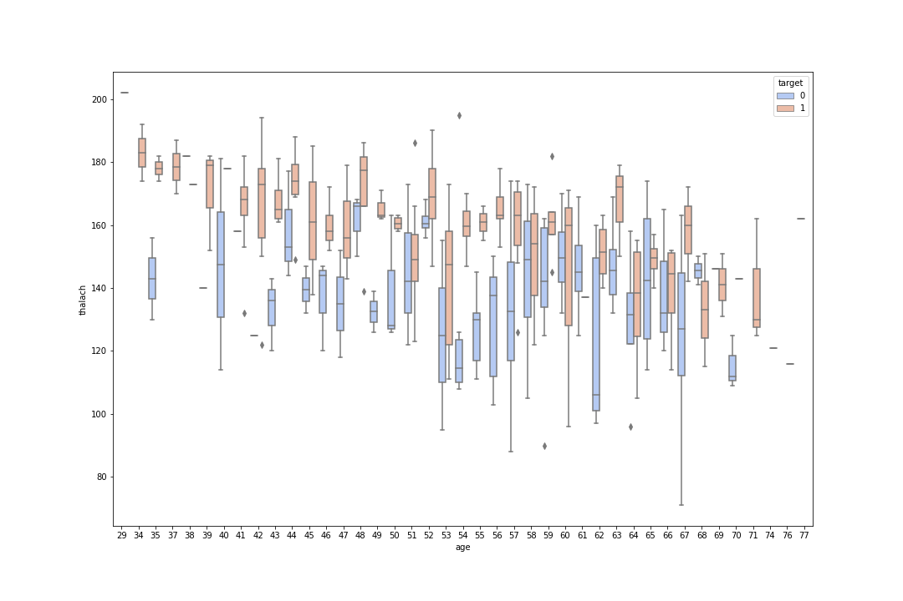

**Korelasi Variabel**
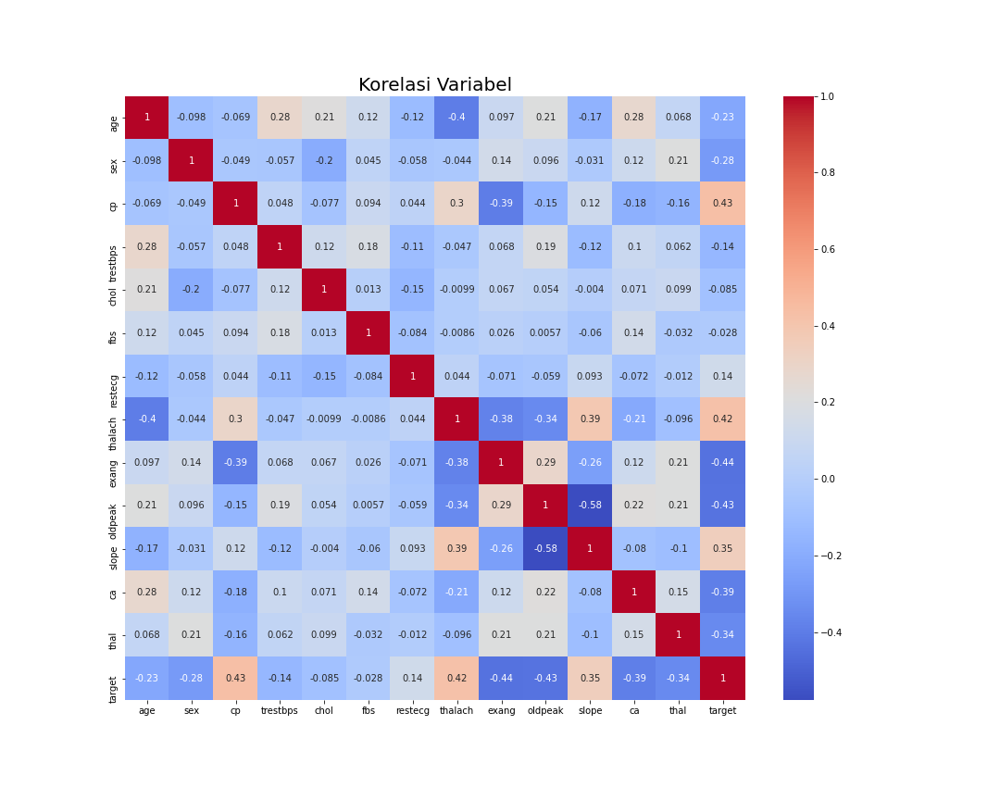

#
### Evaluation Metrics
**Menggunakan RandomForestClassifier**
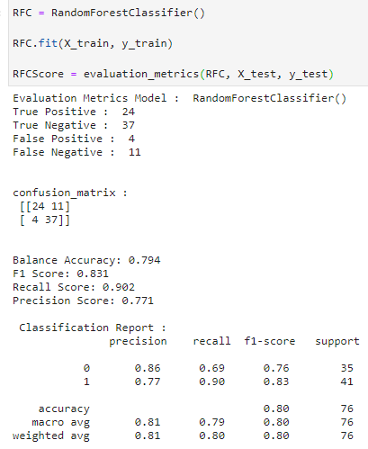

#
### Kesimpulan dan Saran
**Kesimpulan**
- Lebih dari 50% dari data, menderita penyakit jantung
- Jenis kelamin laki-laki lebih berisiko terkena penyakit jantung
- Usia lebih tua juga lebih rentan terkena penyakit jantung
- Pasien dengan tekanan darah tinggi, belum tentu memiliki penyakit jantung
- Pasien dengan denyut nadi yang tinggi kemungkinan memiliki penyakit jantung
- Digunakan model randomforest karena memiliki score balance accuracy tertinggi

**Saran**
- Kemungkinan dapat menambah beberapa feature lainnya, dikarenakan penyakit jantung tidak akurat jika dilihat dari features-features yang ada
- Kemungkinan dapat menambahkan feature genetik, uji stress, penyakit sistemik lainnya, merokok, konsumsi alkohol, BMI
- Untuk pemeriksaan menggunakan machine ini kemungkinan diperlukan alat lain, karena adanya pemeriksaan tekanan darah, kolestrol, ekg, dan lain-lain

#
### Dashboard
#### Home
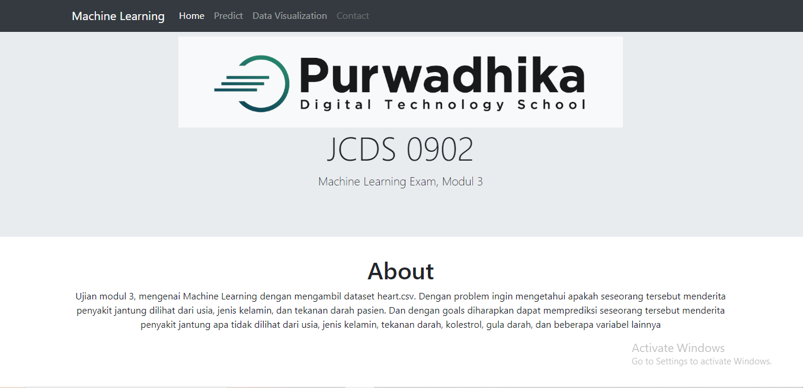

#### Prediksi
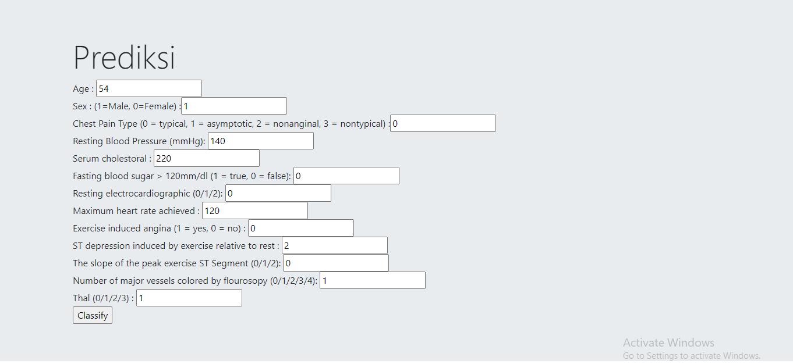

#### Hasil
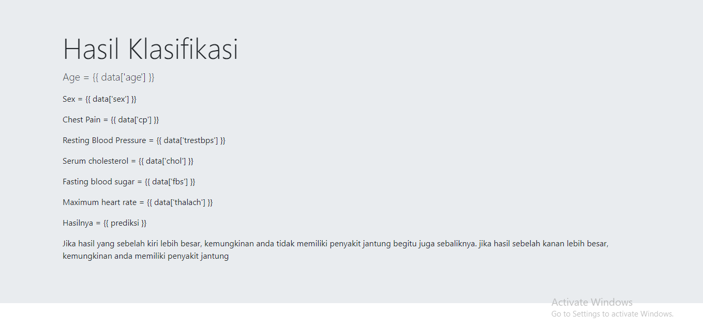
*saya stuck dibagian dashboard hasil, tidak bisa mengimport ke python. bolak-balik nyoba joblib dan pickle tetap error saat import model*

#### Data Visualization
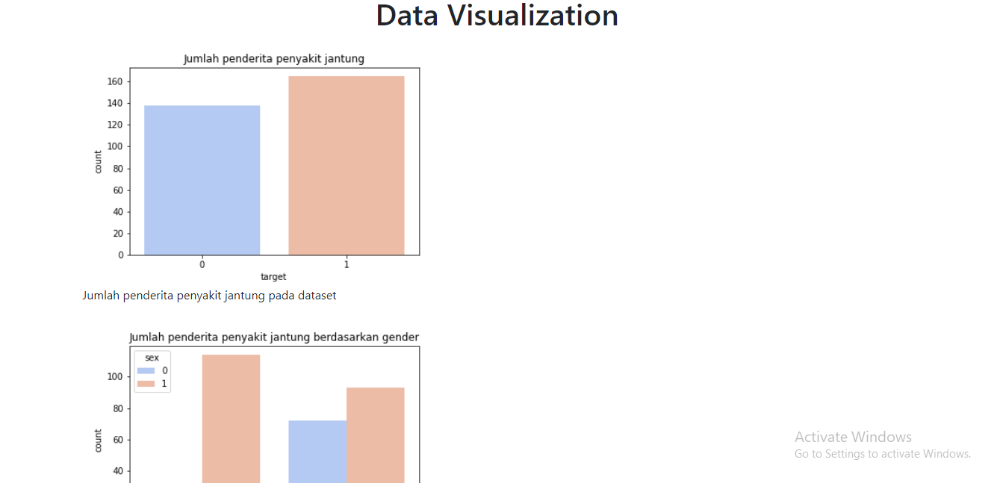
